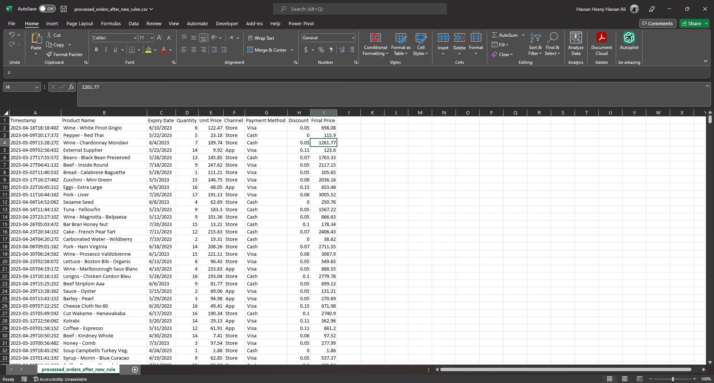
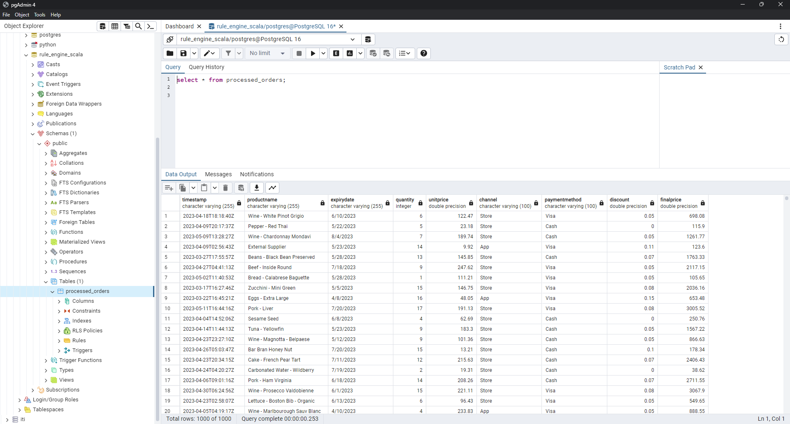
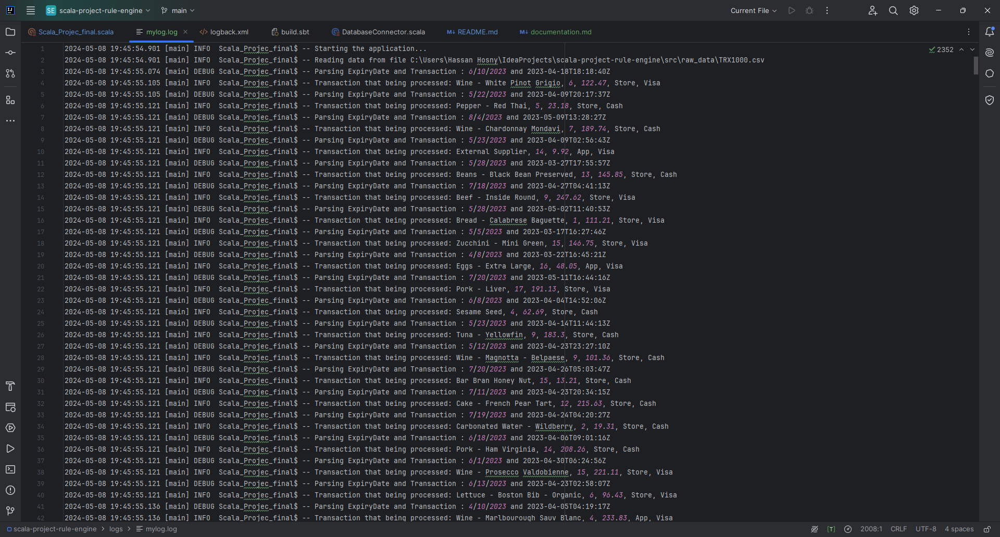
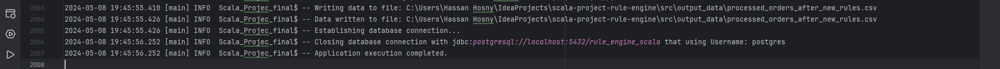

# Scala Project

# Scala Discounts Rule Engine

A Scala Real-Time Rule Engine project designed to apply different discount rules to real-time transaction data and store the results in a PostgreSQL database. It utilizes SLF4J for logging with Logback configuration.

## Problem Statement

A large retail store requires a rule engine to qualify order transactions for discounts based on predefined rules. The system needs to operate continuously, processing raw transaction files automatically upon arrival.

## Project Details

The Scala Real-Time Rule Engine monitors and processes CSV files as they are pushed to the specified directory. It applies various discount rules to the data based on predefined calculation rules and stores the results in a PostgreSQL database. Additionally, it logs data events using SLF4J with Logback configuration and backs up all data into CSV files.

## Discount Rules

The project applies the following discount rules to transaction data:

- **Expiration Date Discount**: Discounts are applied based on the number of days remaining between the purchase date and the expiration date.
- **Product Category Discount**: Discounts are applied based on the product category (e.g., "Cheese" or "Wine").
- **Specific Day of Month Discount**: Special discounts are applied to purchases made on specific days of the month.
- **Quantity Discount**: Discounts are applied based on the quantity of products purchased.
- **Purchasing Channel Discount**: Discounts are applied based on the purchasing channel (e.g., "App").
- **Payment Method Discount**: Discounts are applied based on the payment method (e.g., "Visa").

## Main Rules

- Transactions not qualifying for any discount receive a 0% discount.
- Transactions qualifying for multiple discounts receive the top two discounts, averaged.

## Project Technicality

- Written in Scala using a purely functional approach.
- Follows Functional Programming principles with pure, immutable functions and data structures.
- No loops or null values are used.

## Main Functions

- `parseDateFromExpiryDate`: Parses a date from a string representing an expiry date.
- `parseDateFromTimeStamp`: Parses a date from a string representing a timestamp.
- `lessThan30DaysRemaining`: Checks if there are less than 30 days remaining between two dates.
- `isCheeseOrWine`: Checks if a product name contains "cheese" or "wine".
- `isMarch23rd`: Checks if a transaction occurred on March 23rd.
- `boughtMoreThan5`: Checks if quantity bought is more than 5.
- `isAppChannel`: Checks if the channel is "app".
- `isVisa`: Checks if the payment method is "visa".
- `calculateDaysRemainingDiscount`: Calculates discount based on remaining days.
- `calculateProductDiscount`: Calculates discount based on product name.
- `calculateMarch23Discount`: Calculates discount based on transaction date (March 23rd).
- `calculateQuantityDiscount`: Calculates discount based on quantity bought.
- `calculateQuantityDiscountRounded`: Calculates rounded quantity discount.
- `calculateVisaDiscount`: Calculates visa discount.

## How It Works

The project reads data from CSV files, processes it, calculates discounts, and writes the results to a PostgreSQL database. Logs are generated using SLF4J with Logback configuration. Backup CSV files are also created.

## Project Main Files

- `raw_data`: Source directory being monitored.
- `output_data`: Contains backup CSV data files.

## Tools and Technologies

- Scala Programming Language
- PostgreSQL Database
- IntelliJ IDE
- SLF4J for logging
- Logback for logging configuration

## Dependencies

The project relies on the following dependencies:

- **Scala 2.13.6**
- **PostgreSQL JDBC Driver**: 
  - https://jdbc.postgresql.org/download/
### logback.xml 
```
<configuration>
  <appender name="FILE" class="ch.qos.logback.core.FileAppender">
  <file>logs/mylog.log</file>
  <encoder>
  <pattern>%d{yyyy-MM-dd HH:mm:ss.SSS} [%thread] %-5level %logger{36} -%kvp- %msg%n</pattern>
  </encoder>
  </appender>

  <root level="debug">
    <appender-ref ref="FILE"/>
  </root>
</configuration>
```

### Also add this to build.sbt
```
libraryDependencies ++= Seq(
      "com.typesafe.scala-logging" %% "scala-logging" % "3.9.5",
      "ch.qos.logback" % "logback-classic" % "1.3.5"
    )
```

## How to Use

1. Clone the repository and navigate to the project directory.
2. Compile the code.
```
scala Scala_Projec_final.scala
```
3. Run the code.
```
scala Scala_Projec_final
```
4. Create the necessary tables in the PostgreSQL database and update the connection information.
5. Add CSV files containing transaction data to the `raw_data` folder.
6. The program will automatically process the new file, apply discount rules, and store the results in the database.
7. Events will be logged using SLF4J with Logback configuration will automatically saved as `mylog.log` in logs directory.
8. Output data CSV file will be created in the `output_data` directory.

# SnapShots
**CSV Output**


**DataBase Output**


**Logs**

